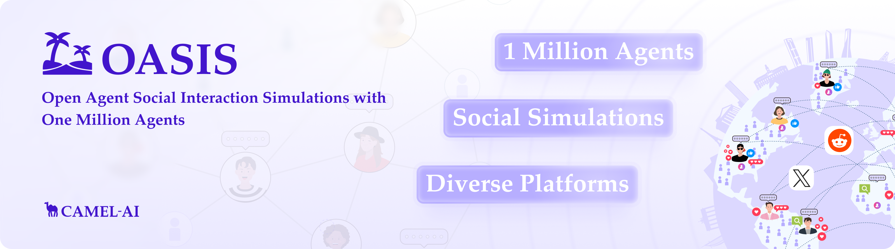

<div align="center">
  <a href="https://www.camel-ai.org/">
    
  </a>
</div>

<br>

<div align="center">

<h1> OASIS UX Simulation App
</h1>

**AI-Powered User Experience Testing & Social Simulation Platform**

[](LICENSE)
[](https://www.python.org/downloads/)
[](https://playwright.dev/python/)
[](https://gradio.app/)

</div>

<br>

<p align="left">
The <strong>OASIS UX Simulation App</strong> is an open-source platform that uses Large Language Models (LLMs) to simulate how diverse, realistic user personas interact with websites, content, and brand imagery. Built as an extension of the original <a href="https://github.com/camel-ai/oasis">CAMEL-AI OASIS</a> social simulation research, this application brings agentic simulation out of the lab and into practical UX research, marketing, and product design.
</p>

---

## ✨ What It Does

Instead of waiting weeks for human focus groups, the OASIS UX Simulation App allows you to test your digital products against a synthetic panel of AI personas in minutes.

1. **Scrape & Synthesize:** Enter any URL. The app bypasses bot-detection (Cloudflare, reCAPTCHA), scrapes the content, and generates a diverse panel of realistic user personas tailored to the site's target audience.
2. **Real-World Grounding:** Optionally pull live social signals from Reddit, Hacker News, GitHub, Bluesky, and TikTok to shape the personas' opinions based on what real people are saying *today*.
3. **Multi-Modal Simulation:**
   - **Mode 1 (Content):** Personas react to social media copy and messaging.
   - **Mode 2 (Browser):** Personas navigate the live website using headless browsers, recording their clicks, scrolls, and frustrations on video.
   - **Mode 3 (Visual):** Personas critique brand imagery and UI screenshots using Vision LLMs.
4. **Automated UX Reporting:** The system runs a heuristic accessibility scan, generates AI-driven HTML redesigns for identified issues, and compiles everything into a presentation-ready PDF slide deck.

---

## 🏗️ Architecture & Pipeline

The application is built on a modern, asynchronous Python stack with a Gradio web interface.

### 1. The CAPTCHA Guard & Stealth Browsing
Standard headless browsers are immediately blocked by modern CDNs. OASIS uses **CloakBrowser**, a custom-patched Chromium binary that alters canvas, WebGL, and CDP fingerprints at the C++ level. This allows the app to silently bypass Cloudflare Turnstile and reCAPTCHA v3 without relying on slow, paid solving services. The cleared session cookie is then handed off to the scraper and the Mode 2 simulation agents.

### 2. Parallel Simulation Engine
All LLM calls and browser sessions run on a persistent background `asyncio` event loop. Simulation modes (Content, Browser, Visual) execute concurrently. Within Mode 2, up to `MAX_BROWSER_SESSIONS` personas navigate the target website simultaneously, each using a deterministic browser fingerprint seed so they appear as distinct devices to the target server.

### 3. Marpit PDF Report Pipeline
The final UX report is not a generic text dump. The app builds a typed `SlideReportData` object, converts it to a Marpit-compatible Markdown AST, and pipes it through a Node.js rendering engine using a strict, design-token-based CSS theme. The resulting HTML is captured by Playwright into a landscape PDF presentation.

---

## 🚀 Quick Start

### Prerequisites
- Python 3.11+
- Node.js 20+ (for the Marpit PDF rendering engine)
- Ubuntu/Debian Linux or macOS (Windows users should use WSL2)

### Installation

1. **Clone the repository:**
   ```bash
   git clone https://github.com/Greene-ctrl/oasis.git
   cd oasis
   ```

2. **Install Python dependencies:**
   ```bash
   pip install -r ux_sim_app/requirements.txt
   ```

3. **Install Node.js dependencies:**
   ```bash
   npm install
   ```

4. **Install browser binaries:**
   ```bash
   playwright install chromium
   python -m cloakbrowser install
   ```

### Configuration

Copy the example environment file and add your API keys:

```bash
cp ux_sim_app/.env.example ux_sim_app/.env
```

At a minimum, you must provide an `OPENAI_API_KEY` (or a compatible endpoint like OpenRouter or Helmholtz Blablador). See the `.env` file for advanced configuration options including proxy settings, CAPTCHA timeouts, and SMTP email delivery.

### Running the App

Start the Gradio web server:

```bash
python -m ux_sim_app --port 7860
```

Open `http://localhost:7860` in your browser.

---

## 🧩 Open Source Projects & References

The OASIS UX Simulation App builds upon and adapts several outstanding open-source projects. We are deeply grateful to their authors and communities.

### Browser Automation & Stealth

| Project | Role in OASIS | License | Repository |
|---|---|---|---|
| **Playwright** | Headless browser automation for Mode 2 persona simulations, UX screenshots, and PDF export. | Apache 2.0 | [microsoft/playwright](https://github.com/microsoft/playwright) |
| **CloakBrowser** | Stealth Chromium binary (49 C++ patches) that bypasses Cloudflare Turnstile, reCAPTCHA v3, FingerprintJS, and BrowserScan bot detection. Adapted here to provide deterministic per-persona fingerprinting. | Proprietary (free tier) | [CloakHQ/CloakBrowser](https://github.com/CloakHQ/CloakBrowser) |

### Slide & Report Generation

| Project | Role in OASIS | License | Repository |
|---|---|---|---|
| **Quarkdown** | Markdown-to-HTML slide rendering engine with reveal.js output. Replaced the legacy Marpit pipeline to support advanced design kit injection and theming. | MIT | [iamgio/quarkdown](https://github.com/iamgio/quarkdown) |
| **frontend-slides** | Curated visual styles and layout presets (e.g., Bold Signal, Electric Studio) integrated into the design chooser for slide generation. | MIT | [zarazhangrui/frontend-slides](https://github.com/zarazhangrui/frontend-slides) |
| **designkits.sh** | Official and community brand-inspired design kits (e.g., Stripe, Vercel, Notion) parsed into CSS custom properties for slide theming. | Apache 2.0 / MIT | [designkits.sh](https://designkits.sh) |
| **markdown-presentation** | Inspired the initial approach to converting markdown ASTs into presentation slides before the migration to Quarkdown. | MIT | [markdown-presentation](https://github.com/markdown-presentation) |

### Web UI

| Project | Role in OASIS | License | Repository |
|---|---|---|---|
| **Gradio** | Interactive web UI framework handling all tabs, state management, and streaming status outputs. | Apache 2.0 | [gradio-app/gradio](https://github.com/gradio-app/gradio) |

### HTTP & Scraping

| Project | Role in OASIS | License | Repository |
|---|---|---|---|
| **httpx** | Async HTTP client used for website scraping, social API calls, and LLM endpoint requests. | BSD 3-Clause | [encode/httpx](https://github.com/encode/httpx) |
| **Beautiful Soup 4** | HTML parsing and structured semantic content extraction from scraped pages. | MIT | [beautifulsoup4](https://www.crummy.com/software/BeautifulSoup/) |

### AI & LLM Integration

| Project | Role in OASIS | License | Repository / Docs |
|---|---|---|---|
| **OpenAI Python SDK** | LLM API client used for persona generation, UX critique, and AI redesign. We adapted it into a custom fallback hierarchy supporting any OpenAI-compatible endpoint (e.g., Helmholtz Blablador). | MIT | [openai/openai-python](https://github.com/openai/openai-python) |
| **NotebookLM Python Client** | Optional integration that queries a user's Google NotebookLM notebook for UX best-practice context. | MIT | [notebooklm-py](https://pypi.org/project/notebooklm/) |

### Real World Data Sources (optional, API-key gated)

| Source | What OASIS uses it for | Docs |
|---|---|---|
| **Reddit JSON API** | Top posts + comments for a topic (free, no key required). | [reddit.com/dev/api](https://www.reddit.com/dev/api/) |
| **Hacker News Algolia API** | Top HN stories matching a topic (free, no key required). | [hn.algolia.com/api](https://hn.algolia.com/api) |
| **GitHub REST API** | Top repositories by star count for a topic (free, 60 req/hr unauthenticated). | [docs.github.com/rest](https://docs.github.com/en/rest) |
| **Bluesky AT Protocol** | Posts from Bluesky matching a topic (requires App Password). | [docs.bsky.app](https://docs.bsky.app/) |
| **ScrapeCreators** | TikTok, Instagram, Threads, and Pinterest content (10,000 free calls). | [scrapecreators.com](https://scrapecreators.com) |
| **Brave Search API** | Web search results (2,000 free queries/month). | [brave.com/search/api](https://brave.com/search/api/) |
| **Perplexity Sonar** | AI-grounded web search synthesis via OpenRouter (pay-as-you-go). | [openrouter.ai](https://openrouter.ai/) |

### Async & Utilities

| Project | Role in OASIS | License | Repository |
|---|---|---|---|
| **anyio** | Async backend abstraction used by Gradio and our persistent background event loop. | MIT | [agronholm/anyio](https://github.com/agronholm/anyio) |
| **python-dotenv** | Loads `.env` configuration at startup. | BSD 3-Clause | [theskumar/python-dotenv](https://github.com/theskumar/python-dotenv) |
| **Pillow** | Image processing for screenshots and report assets. | HPND | [python-pillow/Pillow](https://github.com/python-pillow/Pillow) |

### Inspiration & Related Work

| Project | Relationship |
|---|---|
| **last30days** (mvanhorn) | Inspired the Real World Data tab architecture — parallel multi-source social signal gathering synthesized into persona context. | [mvanhorn/last30days-skill](https://github.com/mvanhorn/last30days-skill) |
| **CAMEL-AI / OASIS** | The original OASIS social simulation research framework that this UX simulation app extends and adapts for practical product design. | [camel-ai/oasis](https://github.com/camel-ai/oasis) |
| **UX Testing Engine** | Core inspiration for the automated heuristic scanning and AI-driven redesign pipeline. | [ux-testing-engine](https://github.com/ux-testing-engine) |
| **Vercel Agent Browser** | Inspired the stealth browser automation and visual testing approach used in Mode 2 and Mode 3 simulations. | [vercel/agent-browser](https://github.com/vercel/agent-browser) |

---

## 🧪 Testing & Development

The project includes a comprehensive test suite covering both the Python backend and the Node.js rendering pipeline.

Run the Python pytest suite (uses mocked LLM responses):
```bash
python -m pytest tests/
```

Run the Node.js Marpit theme smoke tests:
```bash
npm run test
```

---

## 🤝 Contributing

We welcome contributions! Please see [CONTRIBUTING.md](CONTRIBUTING.md) for details on our code of conduct, development workflow, and pull request process.

## 🖺 License

This project is licensed under the Apache License 2.0 - see the [LICENSE](LICENSE) file for details.
